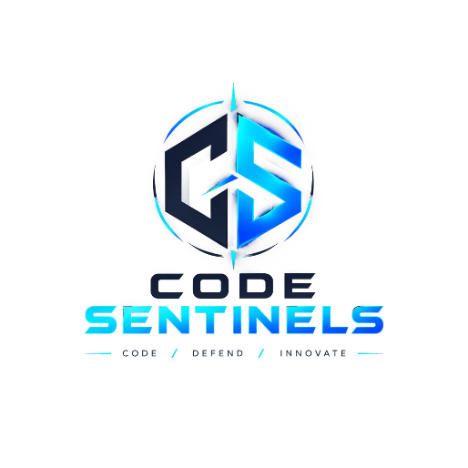
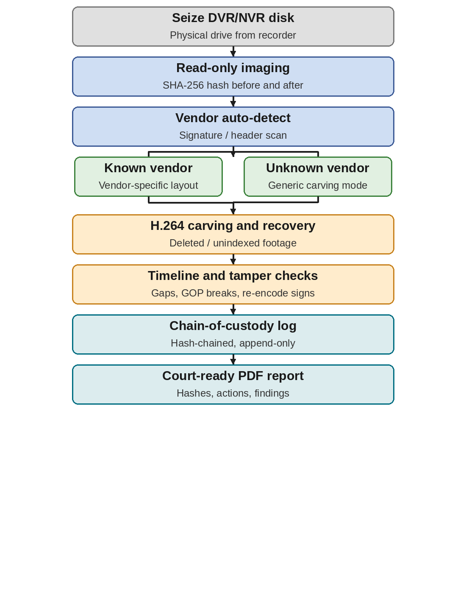
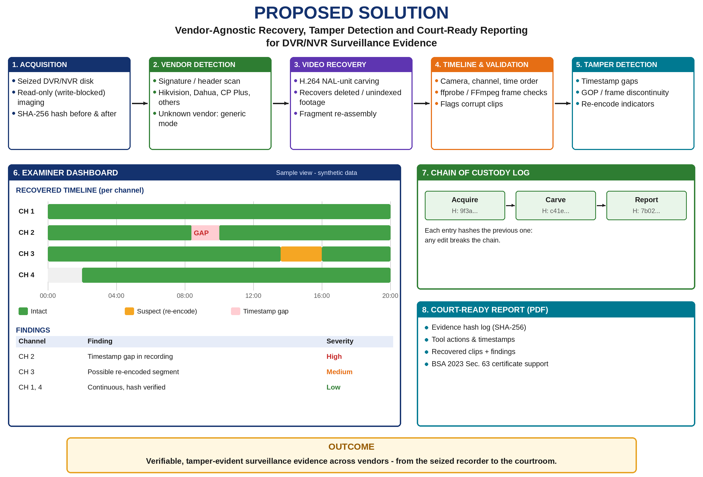

# 🛡️ ForensicVault — Multi-Vendor DVR/NVR Forensic Analysis Suite

<div align="center">



**Smart India Hackathon 2026** • Problem Statement: **SIH26150**  
Theme: Blockchain & Cyber Security • Team: **Code-Sentinels** (ID: 192057)

[](https://www.python.org/)
[](https://flask.palletsprojects.com/)
[](https://www.mha.gov.in/)
[](#)

</div>

---

## 📌 What is this?

**ForensicVault** is an end-to-end digital forensic platform for analysing surveillance footage from DVR/NVR devices (Hikvision, Dahua, CP Plus, Samsung/Hanwha, Bosch, Honeywell). It handles evidence acquisition, proprietary format detection, video recovery, tamper detection, chain of custody, and court-ready reporting — all in one tool.

---

## 🚀 Key Features

| Feature | Description |
|:---|:---|
| 🔒 **Secure Acquisition** | Read-only bit-stream imaging with dual SHA-256 verification |
| 🏭 **Multi-Vendor Detection** | Auto-identifies HIKFS, DHAV, MPEG-PS, SEC formats via magic bytes |
| 🎬 **H.264 NAL Carving** | Recovers deleted/unindexed footage from raw unallocated sectors |
| 🔍 **Tamper Detection** | Detects timestamp gaps, GOP breaks & software re-encoding artifacts |
| ⛓️ **Blockchain Custody** | Append-only SHA-256 hash-chained chain of custody ledger |
| 📄 **Court PDF Report** | BSA 2023 Section 63 certified forensic dossier (ReportLab) |
| 🖥️ **Cyber Dark UI** | Glassmorphism 2.0 design with particle canvas & live tactical radar |

---

## ⚡ Quick Start

### Windows (1-Click)
```cmd
start.bat
```
Auto-checks Python, installs dependencies, seeds the database, and opens `http://127.0.0.1:5000/` in your browser.

### Manual (All Platforms)
```bash
pip install -r requirements.txt
python backend/seed_data.py   # seed demo data
python app.py                 # start server → http://127.0.0.1:5000/
```

---

## 📖 How to Use — Step-by-Step

### Forensic Workflow Overview

<div align="center">
  
</div>

<br>

> **💡 Quickest way to evaluate:** Click **"⚡ Reset Demo Data"** in the top bar — it instantly loads a full realistic 4-camera robbery case so you can explore every feature without uploading any real evidence.

---

### Step 1 — Launch the App

```cmd
start.bat          # Windows: double-click this file
# OR
python app.py      # All platforms
```
Open `http://127.0.0.1:5000/` in your browser. Toggle **☀️ / 🌙** in the top bar to switch between **Cyber Dark** and **Forensic Lab Light** themes.

---

### Step 2 — Register a Forensic Case

1. Click the **"Cases"** tab → **"Register New Case"**
2. Fill in the case details:

```
Case ID       :  CASE-2026-DLH-014
FIR Number    :  FIR-342/2026 U/S 307 IPC
Police Station:  Cyber Forensics Division, New Delhi
Examiner      :  Insp. Yogesh M S
```

3. Click **"Register"** — a Genesis Block is created in the blockchain ledger automatically.

---

### Step 3 — Acquire Evidence (Bit-Stream Imaging)

1. Go to **"Acquisition"** tab → select your case.
2. Enable **Hardware Write-Blocker** toggle.
3. Upload a disk image (`.dd`, `.raw`, `.img`, `.dav`, `.264`, `.mp4`)
4. Click **"Ingest & Verify SHA-256"**

**Sample output:**
```
Pre-Ingest  SHA-256 : 9f3a8b27c14e05d6f4a9...
Post-Ingest SHA-256 : 9f3a8b27c14e05d6f4a9...  ✅ MATCH — ZERO ALTERATION
```

---

### Step 4 — Vendor Auto-Detection

After ingestion, the engine scans the binary headers and reports:

```
Detected Vendor   : Hikvision (HIKFS 4.0)
Confidence        : 98.7%
Magic Signature   : 0x48494B4653 ("HIKFS")
Frame Headers     : HKH stream detected
Storage Layout    : 16-channel mux, 128KB block clusters
```

Supported: `Hikvision` · `Dahua` · `CP Plus` · `Samsung/Hanwha` · `Bosch` · `Honeywell`

---

### Step 5 — Deep H.264 NAL-Unit Carving

1. Go to **"Video & Carve"** tab → click **"Start Deep NAL Carve"**
2. Watch the laser sector scanner scan through unallocated sectors.
3. Results show:

```
Carved Clips Found : 7
Total NAL Units    : 3,842
  ├─ SPS  (Type 7) : 12   — Resolution: 1920×1080, Profile: High
  ├─ PPS  (Type 8) : 12   — Entropy: CABAC
  ├─ IDR  (Type 5) : 287  — Keyframes (I-Frames)
  ├─ NALU (Type 1) : 3497 — Predictive P/B frames
  └─ SEI  (Type 6) : 34   — Camera OSD timestamps
```

Click any carved clip to play it back in the interactive CCTV viewer.

---

### Step 6 — Tamper Detection

1. Go to **"Tamper Detection"** tab → click **"Run Tamper Audit"**

**Sample findings:**

```
⛔ [CRITICAL] Camera 02 — Vault Corridor
   Timestamp Gap: Frame 1420 → 14:22:18
                  Frame 1421 → 14:26:30
   Missing footage: 252 seconds (4 min 12 sec)

⚠️  [WARNING] Camera 03 — Server Room
   Re-encoding detected: 'x264 core 164 r3095'
   Hardware DVRs do NOT use x264. Footage has been tampered.
```

<div align="center">
  
</div>

---

### Step 7 — Multi-Camera Timeline

Go to **"Timeline"** tab. All camera channels are synchronized:

```
CH 1  [Main Gate]       ████████████████████████████████  Intact
CH 2  [Vault Corridor]  ████████████░░░░████████████████  GAP (252s)
CH 3  [Server Room]     ████████████████████▓▓▓▓████████  Re-encoded
CH 4  [Exit Alley]      ░░░░████████████████████████████  Intact
```

---

### Step 8 — Chain of Custody Verification

1. Go to **"Chain of Custody"** tab — view every forensic action as a blockchain block.
2. Click **"Verify Ledger Integrity"**:

```
Block 0: Genesis      SHA-256: a3f1b2c9...
Block 1: Acquisition  SHA-256: 7d8e4f12...  ← links Block 0
Block 2: NAL Carving  SHA-256: 9c3a7b44...  ← links Block 1
Block 3: Tamper Audit SHA-256: 2e6d1f88...  ← links Block 2
Result  : ✅ ALL BLOCKS VALID — ZERO TAMPERING DETECTED
```

---

### Step 9 — Generate Court-Certified PDF Report

1. Go to **"Court Reports"** tab → select your case.
2. Click **"Generate Certified PDF Dossier"** — a multi-page report is built including:
   - Section 63 BSA 2023 Statutory Certificate
   - Examiner Declaration
   - SHA-256 Evidence Hash Table
   - Tamper Findings & Incident Timestamps
   - Full Blockchain Audit Log
3. Click **"Download Official PDF"** → ready for courtroom submission.

---

## 💻 Tech Stack

`Python 3.10+` · `Flask 3.0` · `SQLite` · `ReportLab` · `Pillow` · `HTML5/CSS3` · `SHA-256 Ledger`

---

## 📂 Project Structure

```
SIH_project/
├── app.py                  # Flask server & REST API
├── requirements.txt
├── start.bat               # 1-Click Windows launcher
├── backend/
│   ├── database.py         # SQLite schema
│   ├── seed_data.py        # Demo dataset seeder
│   ├── vendor_detection.py # Multi-vendor signature engine
│   ├── integrity.py        # SHA-256 blockchain ledger
│   ├── video_analysis.py   # H.264 NAL parser & tamper detector
│   └── report_generator.py # BSA 2023 PDF generator
├── static/css/style.css    # Cyberpunk dark theme
├── static/js/app.js        # SPA router, radar, particle canvas
└── templates/index.html    # Single-page app shell
```

---

## ⚖️ Legal Compliance

- **BSA 2023 Section 63** — Admissibility of electronic records in Indian courts
- **ISO/IEC 27037:2012** — Digital evidence collection & preservation
- **NIST SP 800-86** — Forensic techniques integration

---

## 👥 Team Code-Sentinels

**Team ID:** 192057 | **SIH 2026** | **Motto:** *Code / Defend / Innovate*
